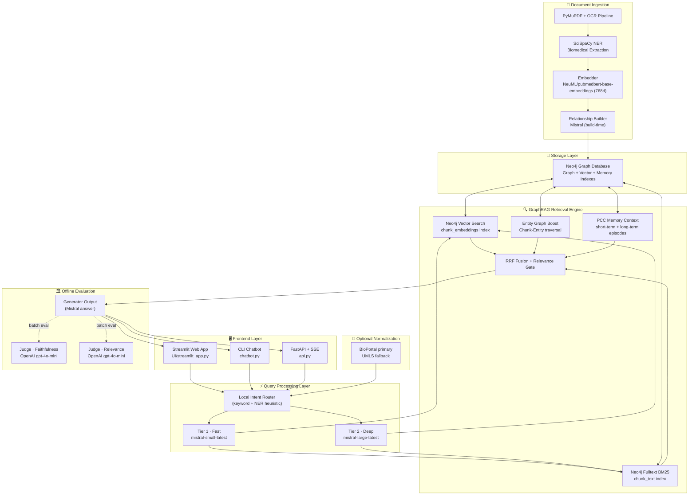

# 🧬 HybdRAG System Architecture
## Code-Aligned Reference (Current)

> **Project:** Biomedical GraphRAG assistant for the Devreotes corpus  
> **Runtime:** Python + Neo4j + Mistral + SciSpaCy  
> **Scope:** Current architecture based on the active codebase

---

## 1. High-Level Architecture



---

## 2. Request Lifecycle (Chat Query)

1. User query arrives from `UI/streamlit_app.py`, `chatbot.py`, or `api.py`.
2. `RAGEngine._prepare_query()` runs:
   - Adds user turn to PCC short-term memory.
   - Extracts entities via SciSpaCy.
   - Optionally normalizes entities via BioPortal/UMLS.
   - In parallel:
     - `GraphStore.search(...)` for paper chunks.
     - `PCCMemory` context retrieval (short + long-term).
3. Retrieved chunks are relevance-gated.
4. `RAGEngine` builds grounded prompt with strict citation policy.
5. Generation call to Mistral:
   - `mistral-small-latest` for normal queries.
   - `mistral-large-latest` for synthesis/evolution intents.
6. Assistant answer is stored back into PCC memory and returned with sources.

---

## 3. Retrieval Design

`graph_store.py` implements a 5-stage hybrid search:

1. Dense vector search in Neo4j (`chunk_embeddings`).
2. BM25 fulltext search (`chunk_text` index).
3. Candidate merge.
4. Reciprocal Rank Fusion (RRF).
5. Entity-graph boost from chunk-entity edges.

Notes:
- Dense and BM25 run in parallel.
- Query embedding model is `NeuML/pubmedbert-base-embeddings` (768-dim).
- Relevant constants in `rag_engine.py`:
  - `TOP_K_RETRIEVAL = 14`
  - `RELEVANCE_THRESHOLD = 0.015`

---

## 4. PCC Memory Architecture

Implemented in `pcc_memory.py` and wired from `rag_engine.py`.

- **Short-term memory**
  - Sliding window (`SHORT_TERM_WINDOW = 10`).
  - Compression is lazy (runs on retrieval, not on every write).
- **Long-term memory**
  - Stored as `MemoryEpisode` nodes in Neo4j.
  - Vector retrieval through `memory_episode_embeddings` index.
  - Retention window: `LONG_TERM_EXPIRY_DAYS = 30`.
- **Prompt injection**
  - Memory is injected as dedicated context blocks, distinct from paper sources.

---

## 5. LLM/External Calls by Layer

- **Mistral (runtime chat path)**
  - 1 generation call per answered query.
  - Optional extra Mistral calls for memory compression when thresholds are hit.
- **Neo4j (runtime chat path)**
  - Retrieval and memory vector queries (no API token billing).
- **BioPortal/UMLS (optional)**
  - Called only when biomedical normalizer is enabled and entities are extracted.
- **OpenAI Judge**
  - Used only in `evaluation/llm_judge.py`, not in normal chat flow.

---

## 6. Core Runtime Files

- `rag_engine.py`: end-to-end orchestration and generation.
- `graph_store.py`: Neo4j retrieval/build logic.
- `pcc_memory.py`: short/long-term memory management.
- `biomedical_normalizer.py`: BioPortal/UMLS normalization.
- `api.py`: FastAPI backend + streaming endpoint.
- `UI/streamlit_app.py`: primary UI.
- `chatbot.py`: CLI interface.
- `conversation_store.py`: persisted chat metadata/messages in Neo4j.

---

## 7. Environment Configuration

Required for main runtime:

```bash
MISTRAL_API_KEY=...
NEO4J_URI=neo4j://127.0.0.1:7687
NEO4J_PASSWORD=...
```

Optional:

```bash
NEO4J_USER=neo4j
BIOPORTAL_API_KEY=...
UMLS_API_KEY=...
OPENAI_API_KEY=...   # only for evaluation/llm_judge.py
```

---

## 8. Ingestion / Build Path (Offline)

Primary build flow:

- `build_index.py` prepares chunks/metadata.
- `graph_store.py::build()`:
  - creates constraints/indexes,
  - embeds chunks,
  - discovers relationships (Mistral),
  - writes nodes/edges in batches to Neo4j.

---

## 9. Known Non-Goals

- No automatic web search grounding in the online query path.
- LLM judge is not a per-request safety gate; it is an offline evaluation utility.

---

Last updated: April 2026
