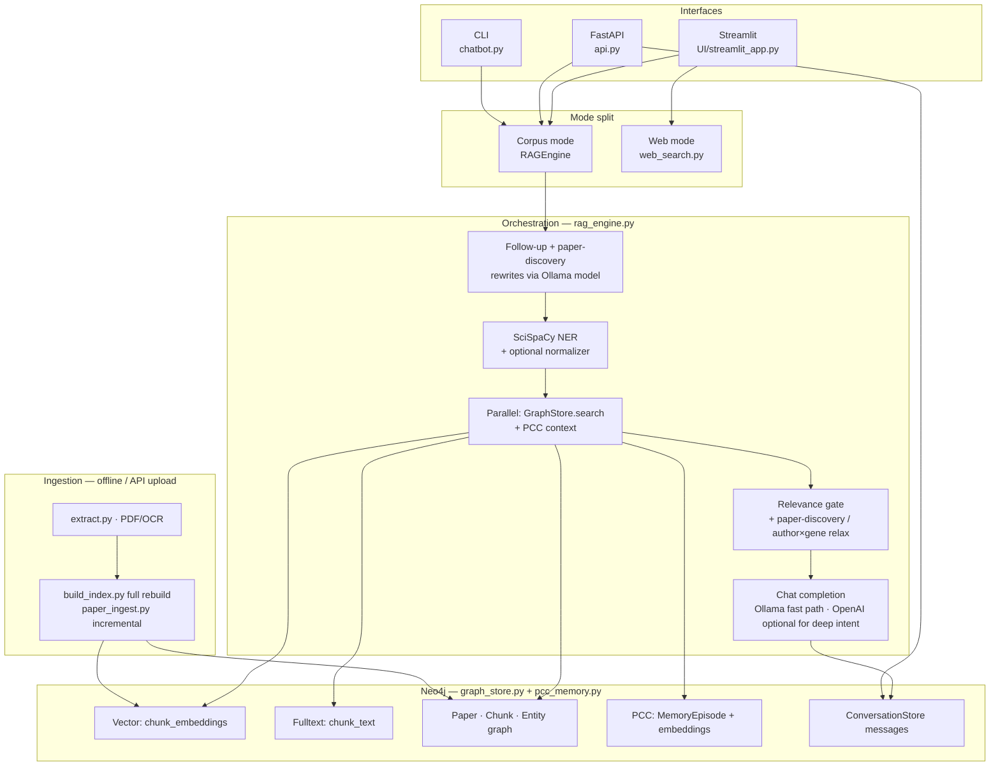

# HybdRAG / DAI — System Architecture

## Code-aligned reference (current repo)

**Product:** DAI — Data Aware Intelligence (Devreotes Research Explorer) · **Stack:** Python, Neo4j, Ollama-compatible LLM (OpenAI client), SciSpaCy, optional BioPortal/UMLS, optional OpenAI for deep reasoning and web mode.

---

## 1. Layered model (what each layer does and why)

| Layer | Responsibility | Why this approach |
| --- | --- | --- |
| **Presentation** | `UI/streamlit_app.py` (corpus vs web mode), `api.py` (REST + SSE), `chatbot.py` (CLI) | Same engine for all surfaces; Streamlit for demos, FastAPI for integrations, CLI for ops. |
| **Orchestration** | `rag_engine.py` — session binding, rewrites, intent routing, parallel prep, generation, PCC hooks | One place owns the chat contract (`ask` / `ask_stream`), graph shortcuts, and refusal paths. |
| **Retrieval** | `graph_store.py` — dense ANN + BM25, RRF, entity boost; optional `get_authors_for_molecule` | Hybrid beats either alone on biomedical phrasing; RRF is stable without tuning two score scales; graph boost uses extracted entities. |
| **Memory** | `pcc_memory.py` — short-term window, lazy compression, long-term episodes in Neo4j | Keeps follow-ups coherent without stuffing full history into every prompt; episodic store is queryable and bounded. |
| **Normalization** | `biomedical_normalizer.py` (optional) | Aligns surface strings to canonical concepts when API keys are present. |
| **Ingestion** | `extract.py`, `paper_ingest.py`, `build_index.py` — PDF → chunks, embeddings, Neo4j graph | Offline/full build vs incremental upload without rebuilding the whole index. |
| **Web (out-of-corpus)** | `web_search.py` — DuckDuckGo, scrape, OpenAI streaming | Live web uses OpenAI cloud by design (not the Ollama host) to avoid overloading RunPod and to keep latency predictable. |
| **Config** | `model_config.py`, `.env` | Single place for Ollama base URL, model tags, and optional OpenAI for deep/web. |

---

## 2. End-to-end flow (single direction, top → bottom)

Runtime path is intentionally linear: **client → engine → (retrieval ∥ memory) → generate → client**. Ingestion is a separate vertical pipeline that only feeds Neo4j and chunk assets.

---

## 3. Request lifecycle (corpus chat)

1. **Entry:** Query from Streamlit, `POST /api/chat` or `/api/chat/stream`, or CLI. API resolves `conversation_id`, loads messages, and calls `engine.hydrate_memory_from_messages` + `set_conversation_id`.
2. **Optional shortcut:** `try_author_gene_graph_answer` answers author–gene questions from Neo4j aggregations when the query matches.
3. **`_prepare_query`:** PCC records the user turn; follow-up and paper-discovery rewrites run on the Ollama-compatible client; entities extracted; **retrieval and PCC context run in parallel** (`ThreadPoolExecutor`).
4. **Gating:** If top score is below `RELEVANCE_THRESHOLD` (`0.015`), chunks may still be kept for paper-discovery, rewritten follow-ups, or author×gene relax cases (see `rag_engine.py`).
5. **Generation:** Default path uses **Ollama** (`FAST_MODEL`); intents `cross_paper_synthesis` / `topic_evolution` use **OpenAI** `OPENAI_DEEP_MODEL` when `DEEP_REASONING_BACKEND=openai` and `OPENAI_API_KEY` is set, else same Ollama model with extra params.
6. **Post:** Assistant turn appended; PCC may store long-term episode; API persists messages (assistant `memory_info` persistence can warn on Neo4j property constraints — see walkthrough).

**Web mode:** Streamlit switches to `web_search.ask_stream_web`; no Neo4j retrieval on the hot path; summarisation uses `WEB_SEARCH_OPENAI_MODEL` (OpenAI API).

---

## 4. Hybrid retrieval (`GraphStore.search`)

Stages: **embed query → (dense ∥ BM25) → merge → RRF (k=60) → entity boost → top-k**.

| Stage | Mechanism | Why |
| --- | --- | --- |
| Dense | HNSW/cosine on `chunk_embeddings`, PubMedBERT 768-d | Captures paraphrase and topical similarity. |
| Sparse | Neo4j fulltext on `chunk_text` | Handles exact gene names, methods, rare tokens. |
| RRF | Fused ranks | No fragile score calibration between dense and BM25. |
| Entity boost | Chunk–entity edges when NER names match | Pulls in chunks strongly tied to stated entities. |

Constants in code: `TOP_K_RETRIEVAL = 8`, `TOP_K_PAPER_DISCOVERY = 16` (`rag_engine.py`); embedding model `NeuML/pubmedbert-base-embeddings` (`graph_store.py`).

---

## 5. PCC memory (`pcc_memory.py`)

| Mechanism | Settings | Why |
| --- | --- | --- |
| Short-term | `SHORT_TERM_WINDOW = 10`, compress every `LLM_COMPRESS_EVERY_N = 4` | Bounded context; compression avoids unbounded tokens. |
| Long-term | Store every `STORE_EPISODE_EVERY_N = 8`, min `MIN_EPISODE_MESSAGES = 6`, expiry `LONG_TERM_EXPIRY_DAYS = 30` | Episodic memory without storing every message forever. |
| Injection | Separate block in the user message, not cited as `[S#]` | Avoids false “paper” citations from memory. |

---

## 6. Models by path (`model_config.py`)

| Path | Model | Notes |
| --- | --- | --- |
| Chat (default), rewrites, PCC, ingest metadata/relations | `OLLAMA_MODEL` @ `OLLAMA_BASE_URL` | OpenAI-compatible `/v1` client; `extra_body` for Ollama-native params. |
| Deep synthesis / evolution (optional) | `OPENAI_DEEP_MODEL` | Only if `DEEP_REASONING_BACKEND=openai` and key set. |
| Web search summary | `WEB_SEARCH_OPENAI_MODEL` | OpenAI cloud, not Ollama. |
| Evaluation judge | Configured in `evaluation/llm_judge.py` | Offline only. |

---

## 7. Core files (quick map)

| File | Role |
| --- | --- |
| `rag_engine.py` | Orchestration, rewrites, retrieval prep, generation, graph analytics shortcut, `ingest_pdf_path`. |
| `graph_store.py` | Neo4j schema, hybrid search, embedder, ingest graph build. |
| `pcc_memory.py` | PCC short/long-term memory. |
| `conversation_store.py` | Neo4j chat persistence for API. |
| `extract.py` | PDF text, chunking, SciSpaCy load helper. |
| `paper_ingest.py` | Incremental PDF → Neo4j. |
| `build_index.py` | Full index build. |
| `web_search.py` | Web mode pipeline. |
| `api.py` | FastAPI app, upload ingest worker, analytics route. |
| `model_config.py` | URLs and model IDs. |

---

## 8. API surface (`api.py`)

| Method | Path | Purpose |
| --- | --- | --- |
| GET | `/api/health` | Liveness |
| POST | `/api/chat` | Sync chat |
| POST | `/api/chat/stream` | SSE streaming |
| POST/GET/PATCH/DELETE | `/api/conversations`… | Conversation CRUD + search |
| GET | `/api/memory/status` | PCC snapshot |
| POST | `/api/memory/clear`, `/api/memory/store` | Reset / force episode |
| GET | `/api/papers` | Corpus list |
| GET | `/api/ingest/status` | Upload job state |
| POST | `/api/papers/upload` | PDF incremental ingest |
| GET | `/api/analytics/gene-authors` | Gene → authors rollup |

---

## 9. Environment (minimal)

**Required for typical runtime:** `OLLAMA_BASE_URL`, `NEO4J_URI`, `NEO4J_PASSWORD` (see `api.py` `_REQUIRED_ENV`). Streamlit also requires `OLLAMA_BASE_URL`.

**Optional:** `OPENAI_API_KEY` (deep reasoning, web mode), `BIOPORTAL_API_KEY` / `UMLS_API_KEY`, `DEEP_REASONING_BACKEND`, `OLLAMA_MODEL`, embedding paths, `PDF_DIR`.

---

## 10. Evaluation (offline)

`evaluation/evaluate_chatbot_improv.py`, `evaluation/ragas_eval.py`, `evaluation/llm_judge.py` — see `evaluation/results/` for outputs. Treat metrics as indicative; ground-truth and chunk cleanliness affect scores.

---

*Last updated: April 2026 — aligned with `rag_engine.py`, `model_config.py`, `graph_store.py`, `api.py`.*
