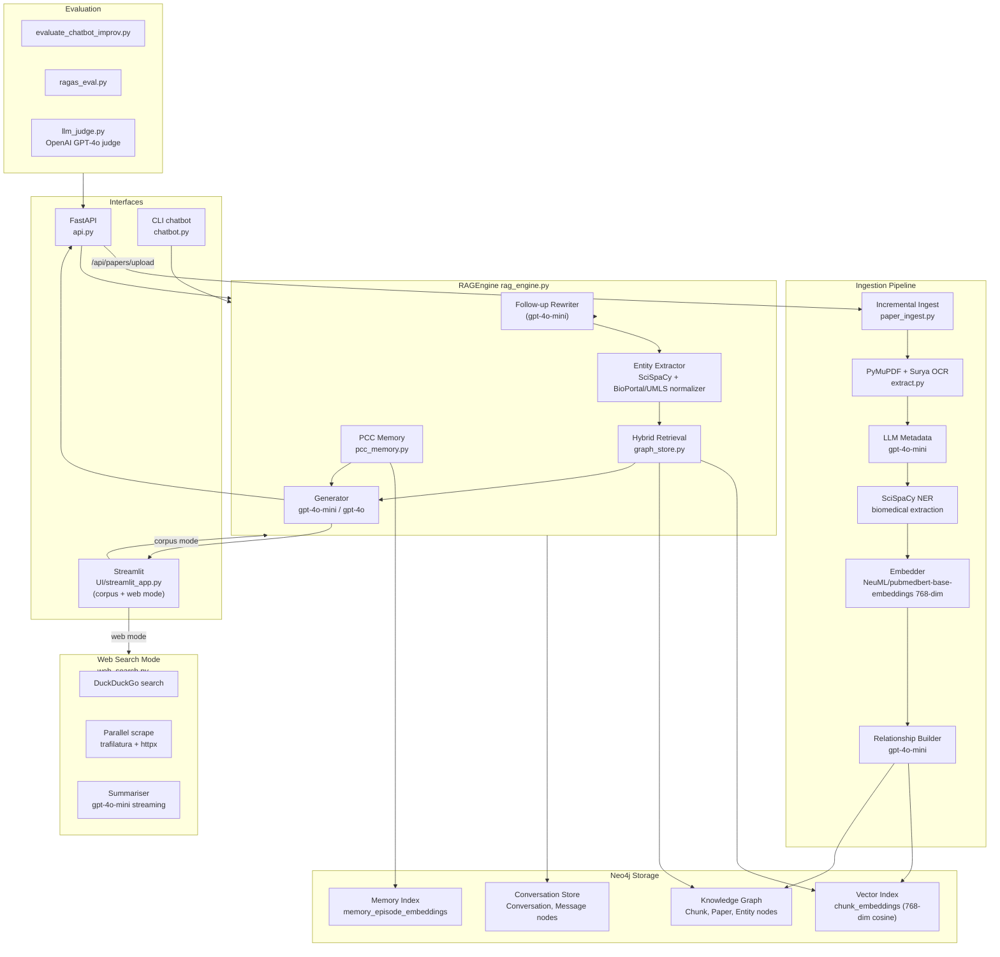
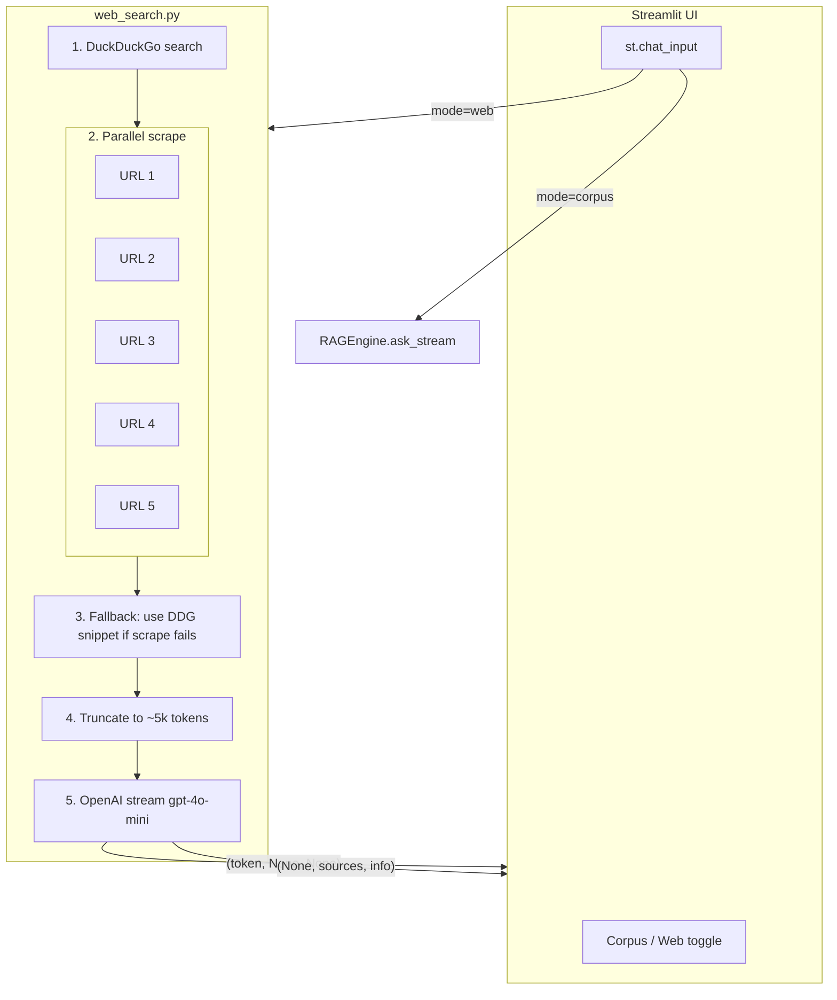

# NovaAI v2 — All Plans & Blueprints (Consolidated Export)

> Exported: April 2026
> Project: DAI — Data Aware Intelligence (Biomedical GraphRAG)

---

# Table of Contents

1. [System Architecture (Current State)](#1-system-architecture-current-state)
2. [Plan: NovaAI Compatibility Review](#2-plan-novaai-compatibility-review)
3. [Plan: Web Search Toggle (Low-Latency)](#3-plan-web-search-toggle-low-latency)
4. [Blueprint: Feature 1 — Graph Query for "Who co-authored work on gene X?"](#4-blueprint-feature-1--graph-query-path)
5. [Blueprint: Feature 2 — Incremental Paper Ingestion](#5-blueprint-feature-2--incremental-paper-ingestion)
6. [Context Window Analysis & Ollama/Qwen3 Fine-Tuning Guide](#6-context-window-analysis--ollamaqwen3-fine-tuning-guide)
7. [Pending: Phase 2 & Phase 3 (To Be Defined)](#7-pending-phase-2--phase-3)

---

# 1. System Architecture (Current State)

**Status: LIVE**

> **Runtime:** Python, Neo4j, OpenAI, SciSpaCy, Surya OCR
> **UI:** Streamlit (direct engine) + FastAPI (REST/SSE backend)

## 1.1 High-Level Architecture



## 1.2 Request Lifecycle (Chat Query)

1. Query arrives from Streamlit, FastAPI (`/api/chat`), or CLI.
2. `api.py` resolves or creates a `conversation_id` via `ConversationStore`, then hydrates the engine with that session's history.
3. `RAGEngine.ask()` / `ask_stream()`:
   - Detects follow-up intent; if true, rewrites query to standalone form via `gpt-4o-mini`.
   - Runs SciSpaCy NER; optionally normalizes via BioPortal/UMLS.
   - Fires hybrid retrieval in parallel (dense vector + BM25 fulltext), then applies RRF + entity-graph boost.
   - Pulls PCC short-term compressed summary + top-3 long-term episodes from Neo4j.
   - Applies relevance gate (`RELEVANCE_THRESHOLD = 0.015`).
   - Routes to `gpt-4o-mini` (default) or `gpt-4o` for synthesis/evolution intents.
   - Returns answer + source chunks + memory metadata.
4. API saves assistant message to `ConversationStore` (Neo4j).

## 1.3 Retrieval Design (graph_store.py)

5-stage hybrid search:

| Stage | Mechanism |
|---|---|
| 1 | Dense vector search -- `chunk_embeddings` index (768-dim cosine) |
| 2 | BM25 fulltext search -- `chunk_text` Neo4j fulltext index |
| 3 | Merge candidates |
| 4 | Reciprocal Rank Fusion (RRF) |
| 5 | Entity-graph boost from Chunk->Entity edges |

- Dense + BM25 run concurrently via `ThreadPoolExecutor`.
- Embedding model: `NeuML/pubmedbert-base-embeddings` (768-dim).
- `TOP_K_RETRIEVAL = 14`, `TOP_K_PAPER_DISCOVERY = 24`.
- DOI/PMID + SHA-256 deduplication at ingest time.

## 1.4 PCC Memory Architecture (pcc_memory.py)

| Layer | Mechanism |
|---|---|
| Short-term | Sliding window of last 10 messages; lazy LLM compression every 4 turns |
| Long-term | `MemoryEpisode` nodes in Neo4j; vector retrieval via `memory_episode_embeddings` |
| Rehydration | On conversation switch, `hydrate_memory_from_messages()` restores state |
| Expiry | `LONG_TERM_EXPIRY_DAYS = 30` |

## 1.5 Web Search Mode (web_search.py)

1. DuckDuckGo search (~1 s, top 5 results).
2. Parallel scrape all 5 pages via `trafilatura + httpx` (~2 s, 5 s timeout/page).
3. Snippet fallback if scraping fails.
4. LRU cache (64 entries) for repeat queries.
5. `gpt-4o-mini` streaming summarization of up to 14k chars of context.

## 1.6 LLM / Model Usage by Path

| Path | Model | Purpose |
|---|---|---|
| Chat generation (default) | `gpt-4o-mini` | Single-hop, entity, follow-up queries |
| Chat generation (deep) | `gpt-4o` | Cross-paper synthesis, topic evolution |
| Query rewriting | `gpt-4o-mini` | Follow-up -> standalone; paper discovery rewrite |
| PCC compression | `gpt-4o-mini` | Short-term memory compression |
| Relationship building | `gpt-4o-mini` | Ingest-time entity relationship extraction |
| Metadata extraction | `gpt-4o-mini` | Ingest-time title/year/authors |
| Web search summarization | `gpt-4o-mini` | Live web mode |
| Evaluation judge | `gpt-4o` | `llm_judge.py` only (offline) |

All model ids overridable via env vars -- see `model_config.py`.

## 1.7 Core Runtime Files

| File | Role |
|---|---|
| `rag_engine.py` | End-to-end orchestration, query rewriting, generation |
| `graph_store.py` | Neo4j retrieval, build logic, RRF, entity boost |
| `pcc_memory.py` | Short/long-term memory management |
| `biomedical_normalizer.py` | BioPortal/UMLS entity normalization |
| `extract.py` | PDF text extraction (PyMuPDF + Surya OCR), chunking |
| `paper_ingest.py` | Incremental PDF ingest without full rebuild |
| `build_index.py` | Full offline index build |
| `refresh_embeddings.py` | Re-embed existing chunks (no rebuild needed) |
| `model_config.py` | Centralized LLM / Ollama / OpenAI env config |
| `conversation_store.py` | Persistent conversation + message storage (Neo4j) |
| `streamlit_archive.py` | Conversation archive/bucketing utilities |
| `web_search.py` | DuckDuckGo + scrape + LLM web search mode |
| `api.py` | FastAPI REST + SSE streaming backend |
| `UI/streamlit_app.py` | Primary Streamlit UI (corpus + web mode) |
| `chatbot.py` | CLI interface |

## 1.8 API Endpoints (api.py)

| Method | Path | Purpose |
|---|---|---|
| GET | `/api/health` | Liveness check |
| POST | `/api/chat` | Synchronous chat |
| POST | `/api/chat/stream` | SSE streaming chat |
| POST | `/api/conversations` | Create conversation |
| GET | `/api/conversations` | List conversations |
| GET | `/api/conversations/{id}` | Fetch conversation |
| GET | `/api/conversations/search` | Fulltext search |
| GET | `/api/memory/status` | PCC memory status |
| POST | `/api/memory/clear` | Clear PCC memory |
| POST | `/api/memory/store` | Force-store memory episode |
| GET | `/api/papers` | List indexed papers |
| GET | `/api/ingest/status` | Ingest job status |
| POST | `/api/papers/upload` | Upload PDF -> incremental ingest |
| GET | `/api/analytics/gene-authors` | Gene x author graph analytics |

## 1.9 Evaluation Framework

| Script | What it measures |
|---|---|
| `evaluate_chatbot_improv.py` | Retrieval (1-5), Correctness (1-5), Groundedness (1-5), Memory continuity (1-5) via token overlap |
| `llm_judge.py` | Faithfulness + relevance judged by `gpt-4o` (offline) |
| `ragas_eval.py` | RAGAS-style metrics |

## 1.10 Known Issues

| Issue | Location | Status |
|---|---|---|
| `memory_info` dict -> Neo4j property TypeError | `conversation_store.py` / `api.py` | Patched with warning; needs serialization fix |
| Groundedness scoring low | `evaluate_chatbot_improv.py` | Binary artifacts in source chunks; needs text-only extraction |
| Memory evaluation broken | `evaluate_chatbot_improv.py` | Must pass `conversation_id` instead of ad-hoc `chat_history` |

---

# 2. Plan: NovaAI Compatibility Review

**Status: ALL COMPLETED**

## Overview

Cross-check the NovaAI_v2 Python stack against the current `RAGEngine` public API and environment variables, fix the evaluation scripts and Streamlit env validation that are out of sync, then smoke-test `chatbot.py` and the Streamlit app.

## To-dos

| ID | Task | Status |
|---|---|---|
| fix-eval-ask-unpack | Update evaluation scripts to unpack 4-tuple from `engine.ask()` | COMPLETED |
| fix-streamlit-env | Streamlit: require correct API key; show OpenAI as optional for eval only | COMPLETED |
| static-verify | Run `compileall` + grep for `engine.ask(` to confirm no stale unpacks | COMPLETED |
| smoke-run | Smoke-test `chatbot.py` and `streamlit run UI/streamlit_app.py` | COMPLETED |

## Issues Found & Fixed

### 1. Broken `engine.ask()` unpacking in evaluation scripts

| File | Was | Fixed To |
|------|-----|----------|
| `evaluation/ragas_eval.py` | `answer, chunks, _ = ...` | `answer, chunks, intent, memory_info = ...` |
| `evaluation/evaluate.py` | `answer, chunks, memory_info = ...` | four values |
| `evaluation/llm_judge.py` | same | same fix |

### 2. Streamlit env check inverted

`UI/streamlit_app.py` was `st.stop()`-ing when `OPENAI_API_KEY` was missing, but the Streamlit chat path only uses `RAGEngine`. Fixed to treat OPENAI_API_KEY as required for chat/RAG and show it properly.

### 3. Unused `QUERIES_PER_MINUTE` constant

Defined but never enforced. Either wire or remove.

---

# 3. Plan: Web Search Toggle (Low-Latency)

**Status: ALL COMPLETED**

## Overview

Add a Corpus/Web toggle in the Streamlit chat bar and a latency-optimised `web_search.py` backend using DuckDuckGo + trafilatura + parallel scraping + OpenAI streaming.

## To-dos

| ID | Task | Status |
|---|---|---|
| add-dependencies | `pip install ddgs trafilatura httpx`; update `requirements.txt` | COMPLETED |
| new-web-search-module | Create `web_search.py` with parallel DDG search, trafilatura extraction, snippet fallback, LRU cache, OpenAI streaming | COMPLETED |
| ui-toggle | Add Corpus/Web segmented control toggle in `UI/streamlit_app.py` | COMPLETED |
| ui-routing | Branch streaming loop on `search_mode`: corpus -> `ask_stream`, web -> `web_search_answer_stream` | COMPLETED |
| ui-indicators | Update placeholder text and add caption/badge for web mode answers | COMPLETED |
| test-end-to-end | Relaunch Streamlit and verify both modes work | COMPLETED |

## Latency Budget

Target: **under 8 seconds** from submit to first token (web mode).

| Phase | Tool | Target | Strategy |
|-------|------|--------|----------|
| Search | DuckDuckGo | ~1s | Single call, 5 results, region=wt-wt |
| Scrape | httpx + trafilatura | ~2s total | Parallel via ThreadPoolExecutor (5 workers), 5s per-page timeout, snippet fallback |
| LLM stream | OpenAI gpt-4o-mini | first token ~0.5s | Stream=True, lean context (~5k tokens) |

## Architecture



## Tool Choices

- **`ddgs`** -- free, no API key, returns titles + snippets + URLs.
- **`httpx`** -- connection pooling, explicit timeouts, faster for parallel fetches.
- **`trafilatura`** -- purpose-built for article extraction, strips nav/ads/footers.
- **`gpt-4o-mini`** (via `FAST_MODEL`) -- cheapest/fastest, reuses existing `OpenAI` client.

## Configuration (as implemented)

```python
MAX_SEARCH_RESULTS  = 5
MAX_SCRAPE_WORKERS  = 5
SCRAPE_TIMEOUT_S    = 5.0
MAX_CHARS_PER_PAGE  = 5000
MAX_CONTEXT_CHARS   = 14_000
_CACHE_MAX          = 64
```

## System Prompt (web mode)

```
You are a knowledgeable biomedical research assistant. You have been given live web search results below.

INSTRUCTIONS:
1. Prioritise the WEB SEARCH CONTEXT -- cite sources as [1], [2], etc.
2. If the search context is partial or thin, supplement with your own scientific knowledge,
   but make clear which parts come from sources and which from general knowledge.
3. Always provide a substantive answer -- never refuse solely because the snippets are short.
4. Be concise, accurate, and scientifically precise.
```

## Edge Cases & Mitigations

**Search layer:**
- DDG rate-limited/down -- catch exception; yield user-facing error message.
- Zero results -- yield "No web results found" message.

**Scrape layer:**
- Paywall/login wall -- `_scrape_one` returns `None` -> falls back to DDG snippet.
- JS-rendered SPA -- trafilatura returns empty; snippet fallback kicks in.
- PDF/binary link -- check `Content-Type` header; skip non-`text/html`.
- Timeout -- 5s per page; abandoned pages use snippet.

**LLM layer:**
- Context too short -- model supplements with own knowledge.
- OpenAI API error -- yields error message to UI.

**UI layer:**
- Toggle mid-conversation -- web answers are ephemeral (not sent to PCC memory).
- Rate limiting -- existing `check_rate_limit()` applies equally to both modes.
- Source display -- `render_sources` works as-is with web source dict shape.

## Dependencies

```
ddgs>=1.0
trafilatura>=2.0
httpx>=0.28
```

## What Stays Unchanged

- `rag_engine.py`, `graph_store.py`, `api.py`, `pcc_memory.py` -- zero modifications.
- PCC memory is NOT used in web mode.
- `render_sources` works as-is.

---

# 4. Blueprint: Feature 1 -- Graph Query Path

**Status: DOCUMENTED (not yet implemented)**

## Problem

The app refuses when no chunks survive retrieval for questions like "who co-authored work on gene X?" because there is no Cypher-backed analytics mode for author-gene aggregation.

## How Answers Are Built (Current)

Vector + BM25 on chunks -> top-K passages -> LLM must cite those passages. Author-gene rollups need Cypher aggregation, which this chat path does not do.

## Why PTEN Can Fail

- Top fused score can fall below `RELEVANCE_THRESHOLD (0.015)` so chunks are dropped.
- PTEN does not match graph entity names for boost.
- Retrieved chunks do not carry the author signal needed.

## Suggested Prompts (Workaround)

**Best prompt for chunk retrieval:**
> In the indexed papers, find passages that discuss PTEN. Quote or paraphrase what they say about PTEN, and list the paper title and year for each. If the passage names authors, include them; if not, say the author list is not in the retrieved excerpts.

**Shorter variant:**
> What do our papers say about PTEN? Cite paper title and year. Include author names only if they appear in the cited excerpts.

## Solution Direction

Add a Cypher-backed "analytics" mode for author-gene aggregation, and/or relax or special-case retrieval for entity+author questions. The existing `get_authors_for_molecule` endpoint in `api.py` (`/api/analytics/gene-authors`) already has this capability -- it needs to be wired into the chat path via intent detection.

---

# 5. Blueprint: Feature 2 -- Incremental Paper Ingestion

**Status: IMPLEMENTED**

## How It Works

### 1. UI -> Upload -> Background Worker

- Streamlit `st.file_uploader` / API `POST /api/papers/upload` triggers upload.
- Saves under `PDF_DIR` with `secure_filename`; rejects duplicate filenames.
- Starts background thread calling `incremental_ingest_pdf`.

### 2. Incremental Ingest Pipeline (paper_ingest.py)

1. **Dedup** by source (PDF filename), file hash (SHA-256), DOI, PMID.
2. **Next chunk IDs** -- monotonic: `max(existing id) + 1`.
3. **Extract + chunk** -- `build_chunks_for_pdf` (metadata cache updated).
4. **Embed** -- SentenceTransformer only for new chunks.
5. **Relationship discovery** -- LLM for new chunks only.
6. **Neo4j** -- MERGE papers/authors/entities/chunks with new relationships.
7. **chunks.json** -- Append new chunks to persistent file.
8. **Reload** -- `store.load()` refreshes in-memory state.

### 3. Why New Graph Nodes "Fit" the Existing KG

Neo4j writes use **MERGE**, not blind CREATE:

- **Papers**: `MERGE (p:Paper {paper_id: ...})` with unique constraints on `paper_id`, `file_sha256`, `doi_normalized`, `pmid`.
- **Entities**: `MERGE` on `(name, node_type)` then append `chunk_ids`, `papers`, `years`.
- **Relations**: `MERGE` on `(subject)-[r:REL {type}]->(object)` then merge evidence.

### 4. Deduplication Layers

| Layer | Mechanism |
|---|---|
| Filename | `store.paper_exists(paper_id)` |
| File hash (SHA-256) | `store.find_paper_id_by_file_hash(sha256)` |
| DOI | `store.find_paper_id_by_normalized_doi(doi)` |
| PMID | `store.find_paper_id_by_pmid(pmid)` |
| Neo4j constraints | Unique constraints on all four identifiers |

### 5. Blueprint for Adoption

| Layer | What to implement |
|--------|-------------------|
| **API** | `POST .../papers/upload` + single-flight lock + `GET .../ingest/status` |
| **Storage** | Stable document key (filename, DOI, or hash); reject duplicates |
| **Chunking** | Globally unique, monotonic chunk IDs |
| **Vector store** | Append embeddings; rebuild BM25 over full corpus |
| **Graph DB** | Use MERGE on clear entity identity so new docs attach to existing nodes |
| **Concurrency** | One lock around read-modify-write of chunk list, vector append, BM25 reload |
| **Failure** | On hard failure after PDF save, delete or tombstone |

---

# 6. Context Window Analysis & Ollama/Qwen3 Fine-Tuning Guide

**Status: ANALYSIS COMPLETE, IMPLEMENTATION PENDING**

## Current Context Window Budget (All 7 LLM Call Sites)

| Call Site | File | Input Tokens | Output Tokens | Total |
|---|---|---|---|---|
| RAG generation (normal) | `rag_engine.py` | ~10,500 | 1,200 | ~12,200 |
| RAG generation (paper discovery) | `rag_engine.py` | ~13,800 | 1,200 | ~15,000 |
| Query rewriting | `rag_engine.py` | ~2,000 | ~200 | ~2,200 |
| PCC compression | `pcc_memory.py` | ~2,500 | ~300 | ~2,800 |
| Relationship discovery | `graph_store.py` | ~1,500 | ~500 | ~2,000 |
| Web search summarization | `web_search.py` | ~5,200 | 1,200 | ~6,400 |
| Metadata extraction | `extract.py` | ~1,500 | ~200 | ~1,700 |

**Heaviest call: ~15,000 tokens (paper discovery mode).**

## Key Constants

```python
# rag_engine.py
TOP_K_RETRIEVAL = 14          # chunks retrieved (normal)
TOP_K_PAPER_DISCOVERY = 24    # chunks retrieved (paper discovery)
MAX_TOKENS = 1200             # output cap
MAX_HISTORY_TURNS = 8         # conversation history pairs

# extract.py
CHUNK_SIZE = 500              # tokens per chunk

# pcc_memory.py
SHORT_TERM_WINDOW = 10        # messages in short-term memory

# web_search.py
MAX_CONTEXT_CHARS = 14_000    # web context (~5k tokens)

# graph_store.py
EMBEDDING_DIM = 768           # NeuML/pubmedbert-base-embeddings
```

## Model Recommendation: Qwen3-8B

| Spec | GPT-4o-mini (current) | Qwen3-8B (Ollama) |
|---|---|---|
| Native context window | 128K tokens | 32K tokens (131K with YaRN) |
| Max input demand | ~15K tokens | Fits in 32K |
| VRAM (Q4_K_M) | N/A (API) | ~5 GB |
| Fine-tune VRAM (QLoRA) | N/A | ~16 GB |

## Fine-Tuning Configuration

### Training data format

```json
{
  "messages": [
    {"role": "system", "content": "You are a scientific research assistant..."},
    {"role": "user", "content": "RESEARCH CONTEXT FROM PAPERS:\n{chunks}\n\n---\n\nQUESTION: {question}"},
    {"role": "assistant", "content": "{gold_answer_with_citations}"}
  ]
}
```

### Unsloth/Axolotl config

```yaml
sequence_len: 16384        # covers max workload + buffer
sample_packing: true       # packs short examples together
```

### Quantization

- **Q4_K_M** -- best speed/quality tradeoff (recommended)
- **Q5_K_M** -- slightly higher quality, ~20% more VRAM
- **Q8_0** -- near-lossless, doubles VRAM

### Ollama Modelfile (after fine-tuning)

```
FROM ./qwen3-8b-novaai-Q4_K_M.gguf
PARAMETER num_ctx 16384
PARAMETER num_predict 1200
```

### .env for Ollama

```bash
OPENAI_API_BASE=http://localhost:11434/v1
OPENAI_API_KEY=ollama
OPENAI_FAST_MODEL=qwen3:8b
OPENAI_DEEP_MODEL=qwen3:8b
```

### Critical Rule

Never deploy with `num_ctx` larger than what you fine-tuned at. If you train at 16K and set `num_ctx 32768` at inference, quality degrades on long inputs.

## Recommended Pipeline

1. Generate 300-500 synthetic QA pairs using current GPT-4o setup (before credits run out).
2. Pull the base model via Ollama: `ollama pull qwen3:8b`.
3. Fine-tune with Unsloth/LoRA on the QA dataset.
4. Quantize to Q4_K_M GGUF and import into Ollama.
5. Switch `.env` and test.

---

# 7. Pending: Phase 2 & Phase 3

**Status: AWAITING SCOPE DEFINITION**

Possible directions under consideration:

### Option A
- **Phase 2:** New Next.js frontend (Landing + DOCS + ASK AI from mockups/prompt.md)
- **Phase 3:** Ollama/Qwen3 fine-tuning + quantization + local deployment

### Option B
- **Phase 2:** Fix evaluation framework (expand to 50+ questions, fix groundedness/memory scoring)
- **Phase 3:** New Next.js frontend

### Option C
- **Phase 2:** New Next.js frontend
- **Phase 3:** Evaluation fixes + Ollama/Qwen3 migration

### Option D
- **Phase 2:** Ollama/Qwen3 fine-tuning + quantization
- **Phase 3:** New Next.js frontend

### Frontend Technology Options
- Full Next.js app (3 pages: Landing, DOCS corpus browser, ASK AI chat) -- replaces Streamlit
- Next.js for ASK AI chat page only, keep Streamlit for admin/ingest
- Streamlit redesign to match UI_temp2 mockup (sidebar chats, globe toggle, model selector, +paper)

### UI Design System (from DESIGN.md / prompt.md)

- **Inspiration:** ElevenLabs-like: near-white canvas, warm stone undertones
- **Typography:** Waldenburg 300 (display), Inter (body), Geist Mono (code)
- **Colors:** `#ffffff`, `#f5f5f5`, warm stone, black, grays
- **Components:** Pill buttons (9999px radius), warm stone CTAs, multi-layer shadows
- **3 Screens planned:** Landing (DOCS + ASK AI cards), DOCS (corpus browser), ASK AI (chat)

---

*End of consolidated plans export.*
