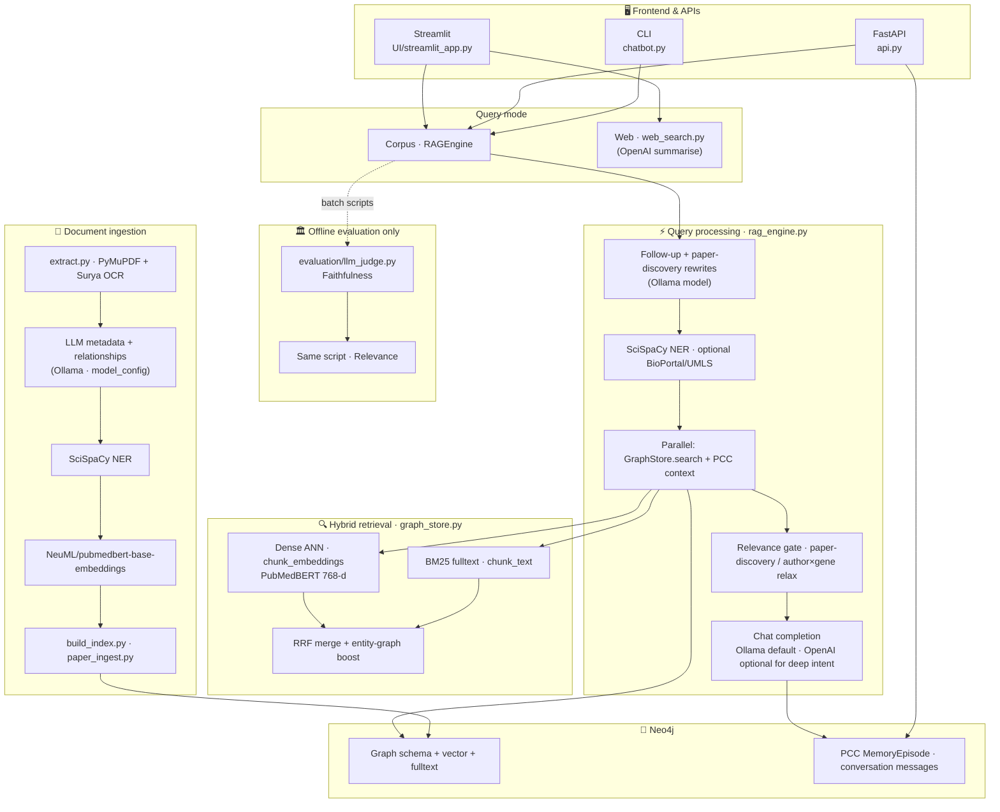
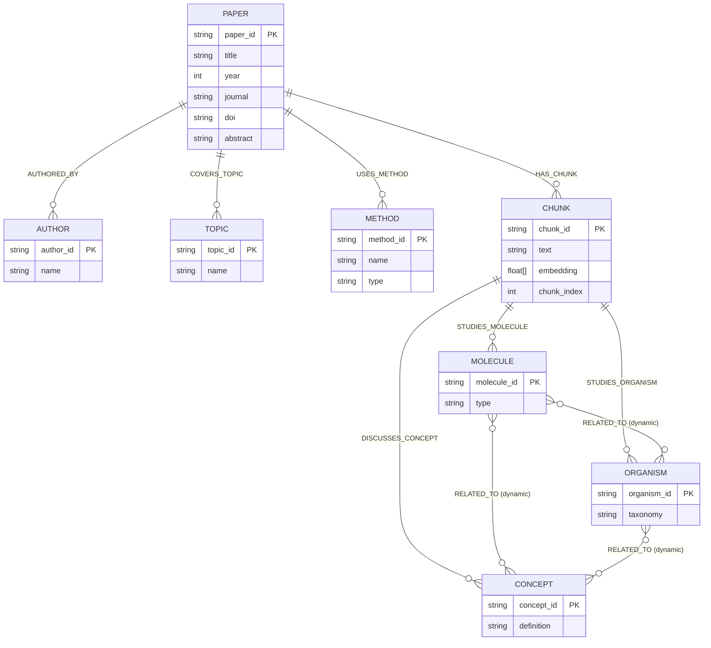
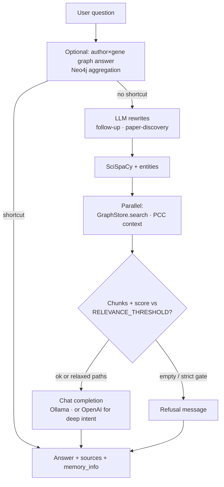

# 🧬 Devreotes Research Explorer — GraphRAG Blueprint

> **Project:** Conversational AI for interrogating the research corpus of Prof. Peter Devreotes (Johns Hopkins University)
> **Domain:** Cell Biology → Signal Transduction & Chemotaxis
> **Approach:** Hybrid GraphRAG with Neo4j, SciSpaCy, Ollama-compatible LLM (OpenAI client), optional OpenAI for deep/web modes, and Surya OCR

---

## 1. System Overview

Runtime path is **linear**: clients → **RAGEngine** (rewrites → NER → hybrid retrieval ∥ PCC → gate → generate) → Neo4j. **Ingestion** is a separate vertical pipeline. **LLM-as-judge** runs only in offline evaluation scripts, not in live chat.



---

## 2. Technology Stack

| Layer | Technology | Purpose |
|---|---|---|
| **Language** | Python 3 | Core runtime |
| **Frontend** | Streamlit (`UI/streamlit_app.py`) | Chat UI (corpus vs web mode) |
| **API** | FastAPI (`api.py`) | REST + SSE, conversations, upload ingest |
| **Graph Database** | Neo4j | Knowledge graph, vector index, fulltext index, PCC + conversation storage |
| **Vector Embeddings** | `SentenceTransformers` (`NeuML/pubmedbert-base-embeddings`, 768-dim) | Chunk + query embeddings aligned with biomedical literature |
| **Scientific NER** | SciSpaCy (`en_core_sci_lg`) | Fast biological entity extraction (proteins, organisms, concepts) |
| **Primary LLM** | Ollama-compatible endpoint (`OLLAMA_BASE_URL`, `OLLAMA_MODEL` via OpenAI client `/v1`) | Rewrites, PCC, ingest metadata/relationships, default answer generation (`model_config.py`). |
| **Optional LLM** | OpenAI API | Deep synthesis / topic evolution when `DEEP_REASONING_BACKEND=openai`; web search summarisation (`WEB_SEARCH_OPENAI_MODEL`). |
| **Evaluation** | `evaluation/llm_judge.py` | Offline faithfulness + relevance scores (judge uses configured Ollama model — not on the live request path). |
| **PDF Processing** | PyMuPDF + Surya OCR | High-accuracy text extraction with OCR fallback for scanned papers. |

> [!TIP]
> **Independent judging (offline):** `llm_judge.py` scores answers against context and the question so the generator is not the only grader. Run it as a batch script; it does not gate production traffic.

---

## 3. Neo4j Knowledge Graph Schema

The schema captures hierarchical attributes and dynamic connections.



### Key Highlights
- **Dynamic relationships**: Relationship extraction during ingest uses the configured Ollama model (`RELATIONSHIP_MODEL` in `model_config.py`) from extracted biomedical entities.
- **Unified Graph + Vectors**: Hybrid retrieval runs dense vector + BM25 fulltext inside Neo4j, then RRF and entity-graph boost — not a separate “fusion service.”

---

## 4. Document Ingestion Pipeline

The pipeline processes massive digital or scanned datasets asynchronously scaling across multiple GPUs and processor cores.

### 4.1 Hybrid OCR Pipeline
- **digital PDFs:** `PyMuPDF` extracts directly for blistering speed.
- **scanned / difficult pages:** `Surya OCR` fires with FlashAttention-2 inside PyTorch to accurately read scientific text layouts.

### 4.2 Entity Extraction
`SciSpaCy` extracts biomedical terminology directly mapping to three major taxonomies inside the schema:
1. **Molecule:** Proteins, genes, DNA/RNA (e.g. PTEN, PIP3).
2. **Organism:** Species and cellular systems (e.g. Dictyostelium).
3. **Concept:** Diseases, general cellular mechanisms, tissues. 

### 4.3 Graph construction via LLM
During batch ingestion (`build_index.py`), chunks are processed with the configured **Ollama** model (see `graph_store.py` / `model_config.RELATIONSHIP_MODEL`) to map explicit mechanistic relations:
```json
{
  "relationships": [
    {"source": "PTEN", "target": "PIP3", "relation": "DEPHOSPHORYLATES"},
    {"source": "Chemotaxis", "target": "Dictyostelium", "relation": "STUDIED_IN"}
  ]
}
```

---

## 5. Query Processing Pipeline

### 5.1 Orchestration (`RAGEngine` — not a separate Mistral “router” tier)

The live path is implemented in `rag_engine.py`: **local intent hints** (`_route_intent_local`), optional **LLM rewrites** for follow-ups and paper-discovery phrasing, **SciSpaCy NER** (and optional normalizer), then **one hybrid retrieval** call plus **PCC memory** in parallel. There is no distinct “small / medium / large” router in code — generation uses **Ollama** by default, with **OpenAI** only for deep intents when configured.



**Intent flavors (examples):** `simple_lookup`, `entity_query`, `cross_paper_synthesis`, `topic_evolution`, `recommendation`, plus **paper-discovery** widening (`TOP_K_PAPER_DISCOVERY`) and **author×gene** analytics (`try_author_gene_graph_answer` / `get_authors_for_molecule`).

### 5.2 Hybrid retrieval & abstain

Retrieval is **`GraphStore.search`**: query embedding → **parallel** dense ANN and BM25 → merged candidates → **RRF** (k=60) → **entity-graph boost** on matching entity names → top-k. Gating uses `RELEVANCE_THRESHOLD` with **exceptions** for paper-discovery, rewritten follow-ups, and author×gene questions (see `rag_engine._prepare_query`). If no chunks pass, the engine returns the standard **refusal** string — not a separate SQL aggregation path for “themes.”

### 5.3 Offline LLM evaluation (Judge)

During batch runs, `evaluation/llm_judge.py` calls the **Ollama judge model** (same OpenAI-compatible client as chat) to score **Faithfulness** (answer vs retrieved context) and **Relevance** (answer vs question). This is **not** invoked by Streamlit or the API during normal chat.

**Verdict Definition = (0.4 × Faithfulness) + (0.6 × Relevance)**  
If `Verdict >= 0.6`, the run treats the answer as passing the scripted threshold.

---

## 6. Project File Structure

*(Aligned with the `NovaAI_v2` repo — adjust drive/path for your machine.)*

```
NovaAI_v2/
├── api.py                  # FastAPI backend (REST, SSE, upload ingest)
├── build_index.py          # Full batch ingestion → Neo4j
├── chatbot.py              # CLI chat loop
├── conversation_store.py # Neo4j-backed conversations for API
├── extract.py              # PDF/OCR, chunking, SciSpaCy helpers
├── graph_store.py          # Neo4j hybrid search, schema, ingest
├── model_config.py         # Ollama URL, model names, optional OpenAI
├── paper_ingest.py         # Incremental PDF ingest
├── pcc_memory.py           # PCC short/long-term memory
├── rag_engine.py           # Orchestration: rewrites → retrieval → generate
├── web_search.py           # Web mode (DuckDuckGo + scrape + OpenAI)
├── requirements.txt
├── .env
├── evaluation/
│   ├── llm_judge.py        # Offline LLM-as-judge (faithfulness + relevance)
│   ├── evaluate.py         # Benchmarks (if used)
│   └── ragas_eval.py
├── UI/
│   └── streamlit_app.py    # Primary Streamlit UI
├── data/
│   ├── chunks.json
│   └── ...
└── docs/
    ├── 01_system_architecture.md
    └── graphrag_blueprint.md
```

---

## 7. Key Dependencies Highlights

* `openai` (Python SDK): OpenAI-compatible client to **Ollama** (`OLLAMA_BASE_URL/v1`) for chat, rewrites, PCC, ingest; optional **OpenAI.com** for deep reasoning and web summarisation when keys are set.
* `sentence-transformers`: Local embeddings (`NeuML/pubmedbert-base-embeddings`) for chunks and queries.
* `neo4j`: Driver for graph + vector + fulltext queries.
* `surya-ocr` & `torch`: OCR pipeline where needed for scanned PDFs.
* `scispacy`: Biomedical NER for query and ingest entity extraction.

---

## 8. Development Commands Quick-Reference

**1. Create your Environment (Windows)**
```powershell
python -m venv .venv_gpu
.\.venv_gpu\Scripts\activate
pip install -r requirements.txt
python -m spacy download en_core_web_sm
```

**2. Ensure Neo4j is Running**
Open **Neo4j Desktop** locally, start your active database, and ensure `neo4j://127.0.0.1:7687` is accessible via `.env`. 

**3. Build the Hybrid Index (One Time Only)**
```powershell
python build_index.py
```
*(Handles OCR on PDFs → Neo4j injection)*

**4. Interacting**

For the terminal application:
```powershell
python chatbot.py
```

For the Streamlit server UI (from repo root):
```powershell
streamlit run UI/streamlit_app.py
```

**5. Evaluate Quality (offline)**
```powershell
python evaluation/llm_judge.py
```
*(Runs the LLM-as-judge loop; outputs e.g. `data/judge_results.json` — see script defaults.)*

---

## 9. Cloud Deployment Strategy

| Component | Proposed Cloud Service |
|:---|:---|
| **Streamlit UI** | Streamlit Cloud (free), Google Cloud Run, or Azure Container Apps |
| **Neo4j** | Neo4j AuraDB (free tier available) |
| **Ollama (RunPod/local)** | Host for primary chat model; expose `OLLAMA_BASE_URL` |
| **OpenAI API** | Optional: deep reasoning, web mode, or future judges — not required for basic corpus chat |
| **GPU Models (Surya OCR, embeddings)** | Only needed for ingestion, not query time |
| **scispaCy NER** | Runs CPU-only, lightweight |
