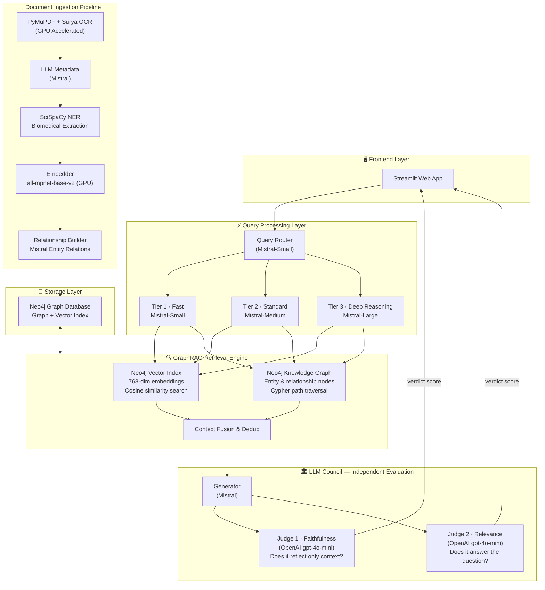
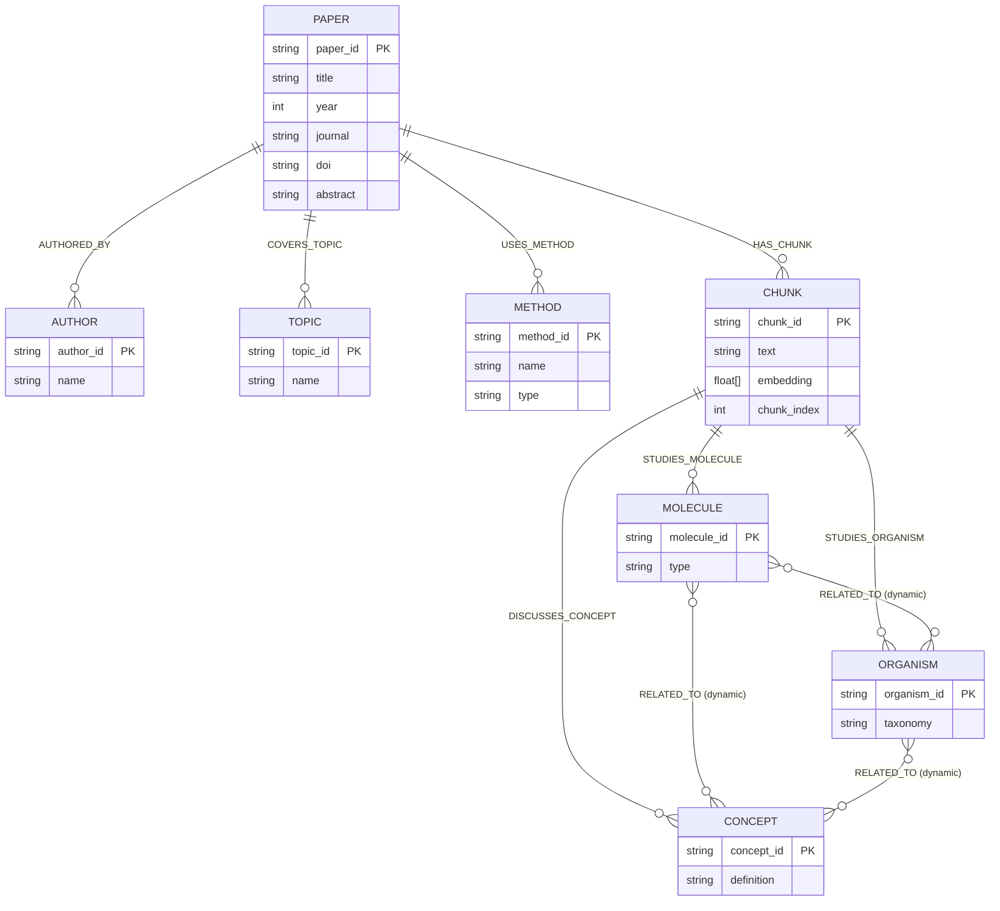
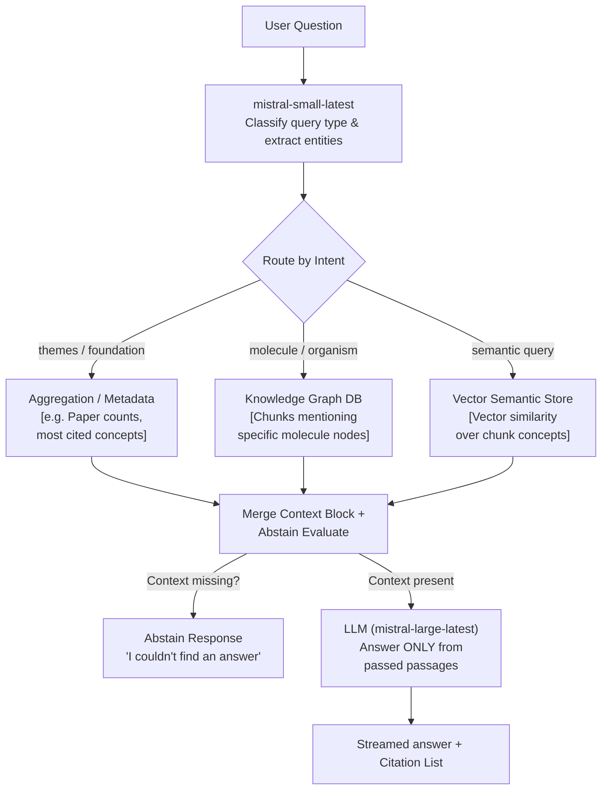

# 🧬 Devreotes Research Explorer — GraphRAG Blueprint

> **Project:** Conversational AI for interrogating the research corpus of Prof. Peter Devreotes (Johns Hopkins University)
> **Domain:** Cell Biology → Signal Transduction & Chemotaxis
> **Approach:** Hybrid GraphRAG with Neo4j, SciSpaCy, Mistral AI, and Surya OCR

---

## 1. System Overview



---

## 2. Technology Stack

| Layer | Technology | Purpose |
|---|---|---|
| **Language** | Python 3 | Core runtime |
| **Frontend** | Streamlit | Chat UI |
| **Graph Database** | Neo4j Desktop | Knowledge Graph and Vector store |
| **Vector Embeddings** | `SentenceTransformers` (`all-mpnet-base-v2`) | Local, GPU-accelerated chunk embeddings (768-dim) |
| **Scientific NER** | SciSpaCy (`en_core_sci_lg`) | Fast biological entity extraction (proteins, organisms, concepts) |
| **Primary LLM** | Mistral AI (`small`, `medium`, `large` latest) | Intent routing, metadata generation, relationship discovery, answer generation. |
| **Evaluation LLM** | OpenAI API (`gpt-4o-mini`) | Independent judge scoring to prevent self-preference bias. |
| **PDF Processing** | PyMuPDF + Surya OCR | High-accuracy text extraction with GPU OCR fallback for scanned papers. |

> [!TIP]
> **Independent Judging matters!** Evaluator scores (Faithfulness and Relevance) are processed by OpenAI API to ensure that Mistral does not exhibit self-preference bias when judging its own output. 

---

## 3. Neo4j Knowledge Graph Schema

The schema captures hierarchical attributes and dynamic connections.



### Key Highlights
- **Dynamic relationships**: `RELATED_TO` edges are synthesized by the LLM (Mistral) from extracted biomedical entities representing actual scientific mechanisms (e.g., `REGULATES`, `LOCATED_IN`).
- **Unified Graph + Vectors**: Semantic search executes inside Neo4j alongside Cypher graph hops.

---

## 4. Document Ingestion Pipeline

The pipeline processes massive digital or scanned datasets asynchronously scaling across multiple GPUs and processor cores.

### 4.1 Hybrid OCR Pipeline
- **digital PDFs:** `PyMuPDF` extracts directly for blistering speed.
- **scanned / difficult pages:** `Surya OCR` fires with FlashAttention-2 inside PyTorch to accurately read scientific text layouts.

### 4.2 Entity Extraction
`SciSpaCy` extracts biomedical terminology directly mapping to three major taxonomies inside the schema:
1. **Molecule:** Proteins, genes, DNA/RNA (e.g. PTEN, PIP3).
2. **Organism:** Species and cellular systems (e.g. Dictyostelium).
3. **Concept:** Diseases, general cellular mechanisms, tissues. 

### 4.3 Graph Construction via Mistral
During batch ingestion (`build_index.py`), chunks are sent asynchronously via Threadpools to `mistral-small-latest` to map out the explicit mechanistic relations:
```json
{
  "relationships": [
    {"source": "PTEN", "target": "PIP3", "relation": "DEPHOSPHORYLATES"},
    {"source": "Chemotaxis", "target": "Dictyostelium", "relation": "STUDIED_IN"}
  ]
}
```

---

## 5. Query Processing Pipeline

### 5.1 Intelligent Query Router (`RAGEngine._route_intent()`)

When a user asks a question, the raw text first passes to a fast classifier (`mistral-small-latest`). This model evaluates the intent of the question and looks for specific types of entities (like molecule or author names). It acts as a traffic cop, routing the question away from generic semantic searches towards optimized database queries.



#### How Routing Assigns the "Table"

Instead of blasting every question to a vector database, the router maps the user's intent to the most efficient specific lookup path:

*   **Relational / Aggregation Queries (`themes`, `foundational_papers`)**: Questions like *"What are the foundational papers?"* or *"What are the most mentioned topics?"*. Vector search is terrible at counting and filtering metadata. The router sends these to structured **Cypher queries** that `ORDER BY p.citations` or `COUNT()` rows.
*   **Graph / Metadata Queries (`simple_lookup`)**: If the query is *"What did they discover about PTEN?"*, the router extracts the entity and performs a direct lookup in the Neo4j Knowledge Graph for chunks explicitly linked to the `[Molecule: PTEN]` node.
*   **Semantic / Vector Queries (`topic_evolution`)**: If the question is broad, like *"How do cells regulate movement?"*, the router falls back to pure Semantic Vector Similarity against the chunks' text embeddings in the Neo4j Index.

### 5.2 Context Fusion & Abstain Checks

Once the specific path pulls its data, the contexts are accumulated. 
1. **Named Entity Tracking** - SciSpaCy dynamically scores chunks referencing the user's target entities.
2. **Neo4j Vector Similarity** - Cosine similarity via `all-mpnet-base-v2` against target embeddings.
3. **Graph Hit Fusion** - A scoring multiplier is added to chunks intersecting on Neo4j edges.

This data goes into a **"Merge Context + Abstain check"**. If the compiled context fails to relate to the user query, an automatic Abstain response (`"Couldn't find an answer within the corpus"`) guarantees zero hallucination.

### 5.3 OpenAI Evaluation (Judge)
During analytical batch workflows (`evaluate.py`, `llm_judge.py`), GraphRAG answers generated by Mistral are audited against independent benchmarks using `gpt-4o-mini`. 

**Verdict Definition = (0.4 × Faithfulness) + (0.6 × Relevance)**
If `Verdict >= 0.6`, the answer is scientifically reliable and contextually grounded.

---

## 6. Project File Structure

```
c:\Users\santosh Arsid\Desktop\Man Cave\Gen AI\Conv AI\HybdRAG_bot\
├── build_index.py          # Batch ingestion + OCR + Graph push logic (warp-speed processing)
├── chatbot.py              # Command-line interface / chat loop
├── evaluate.py             # General benchmarker
├── extract.py              # OCR, scispaCy NER, formatting
├── graph_store.py          # Neo4j connections, constraints, Cypher ingestion blocks and search fns
├── llm_judge.py            # Automated cross-model answer verifier using OpenAI
├── rag_engine.py           # Core conversational class mapping queries -> search -> generate
├── requirements.txt        # Full dependencies
├── .env                    # Secret keys
├── data/
│   ├── chunks.json         # Raw text serialized storage
│   ├── marker_output/      # Markdown representations from text OCR
│   └── judge_results.json  # Output benchmarks
└── ui/
    └── streamlit_app.py    # Modern web-chat UI configuration
```

---

## 7. Key Dependencies Highlights

* `mistralai`: Core LLM powering reasoning, relationship graphs, and metadata generation.
* `openai`: Serves as an independent audit/verdict platform to maintain objectivity. 
* `sentence-transformers`: Local text embedding generation powered via GPU acceleration, radically reducing API costs per paper. 
* `surya-ocr` & `torch`: High accuracy scanning pipelines. 
* `scispacy`: Unsupervised localized tagging of specific bio-entities. 

---

## 8. Development Commands Quick-Reference

**1. Create your Environment (Windows)**
```powershell
python -m venv .venv_gpu
.\.venv_gpu\Scripts\activate
pip install -r requirements.txt
python -m spacy download en_core_web_sm
```

**2. Ensure Neo4j is Running**
Open **Neo4j Desktop** locally, start your active database, and ensure `neo4j://127.0.0.1:7687` is accessible via `.env`. 

**3. Build the Hybrid Index (One Time Only)**
```powershell
python build_index.py
```
*(Handles OCR on PDFs → Neo4j injection)*

**4. Interacting**

For the terminal application:
```powershell
python chatbot.py
```

For the Streamlit server UI:
```powershell
streamlit run ui/streamlit_app.py
```

**5. Evaluate Quality**
```powershell
python llm_judge.py
```
*(Runs an evaluation loop producing metric scorecards)*

---

## 9. Cloud Deployment Strategy

| Component | Proposed Cloud Service |
|:---|:---|
| **Streamlit UI** | Streamlit Cloud (free), Google Cloud Run, or Azure Container Apps |
| **Neo4j** | Neo4j AuraDB (free tier available) |
| **OpenAI / Mistral API** | Keep as-is (external API) |
| **GPU Models (Surya OCR, embeddings)** | Only needed for ingestion, not query time |
| **scispaCy NER** | Runs CPU-only, lightweight |
